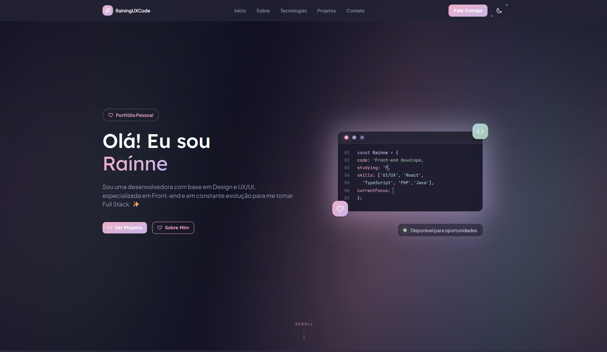
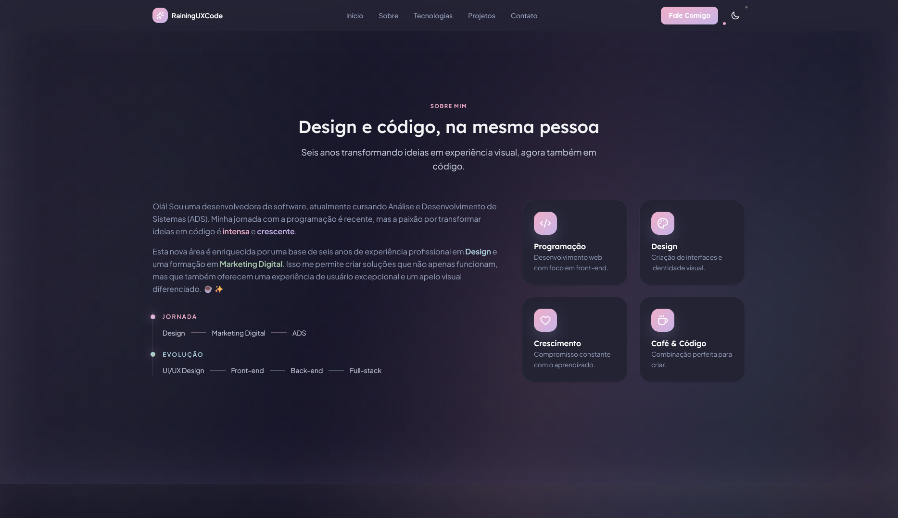
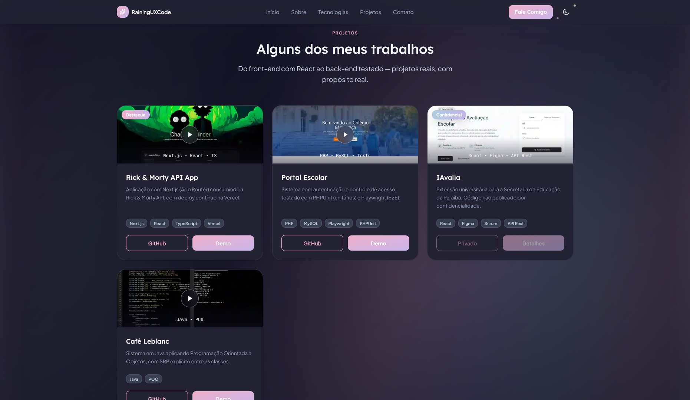

# 🌸 Raínne Carvalho Lima | Portfólio

[](https://react.dev)
[](https://www.typescriptlang.org)
[](https://vite.dev)
[](https://tailwindcss.com)
[](https://portfolio-raininguxcode.vercel.app)

**Site em produção:** [https://portfolio-raininguxcode.vercel.app](https://portfolio-raininguxcode.vercel.app)

Este é meu portfólio pessoal, criado para apresentar minha trajetória entre Design, UX/UI e Desenvolvimento Front-end. O projeto une uma identidade visual suave, componentes reutilizáveis, responsividade e uma experiência pensada para destacar meus projetos de forma clara e agradável.

## Preview

<p align="center">
  
</p>

## Seção Sobre

<p align="center">
  
</p>

## Seção Projetos

<p align="center">
  
</p>

## Destaques

- Interface de página única, pensada para apresentar perfil, stack, projetos e contato com fluidez.
- Identidade visual própria, com atmosfera suave, escura e acolhedora.
- Estrutura em React com componentes reutilizáveis e separação clara entre as seções.
- Imagens, vídeos e ícones otimizados para reduzir peso e melhorar carregamento.
- Experiência responsiva para desktop e mobile.
- Conteúdo voltado à minha atuação em Front-end, UX/UI e evolução para Full Stack.

## Tecnologias

**Base**

- React
- TypeScript
- Vite

**Estilização e interface**

- Tailwind CSS
- Variáveis CSS
- `color-mix()`
- Layout responsivo
- Assets locais em SVG, WebP e MP4

**Qualidade e ferramentas**

- ESLint
- npm scripts
- GitHub Pages
- Vercel

## Funcionalidades

- Hero com apresentação pessoal e chamadas para as seções principais.
- Seção sobre conectando minha base em Design, UX/UI e desenvolvimento.
- Lista de tecnologias com ícones locais.
- Cards de projetos com imagens otimizadas e prévias em vídeo.
- Alternância entre tema claro e escuro com preferência persistida.
- Seção de contato com links profissionais.
- Animações leves e efeitos visuais alinhados à identidade do site.

## Como executar localmente

**Requisitos**

- Node.js 18 ou superior
- npm

```bash
git clone https://github.com/RainingUXCode/portfolio.git
cd portfolio
npm install
npm run dev
```

O servidor local ficará disponível em:

```text
http://localhost:5173
```

## Scripts disponíveis

| Comando | Descrição |
| --- | --- |
| `npm run dev` | Inicia o servidor de desenvolvimento com Vite. |
| `npm run build` | Executa a checagem TypeScript e gera o build de produção. |
| `npm run preview` | Serve o build de produção localmente para revisão. |
| `npm run lint` | Executa o ESLint no projeto. |

## Design System

A interface segue uma paleta inspirada em **Verão Claro / Light Summer**, com tons suaves e frios. Rosa, lavanda, azul acinzentado e verde sálvia aparecem em detalhes, gradientes, bordas e pontos de destaque.

O visual escuro usa contraste suave para manter a leitura confortável sem perder profundidade. A composição combina superfícies com transparência, bordas delicadas, sombras leves e elementos arredondados para criar uma experiência visual mais calma e pessoal.

As cores são organizadas com variáveis CSS e combinações em `color-mix()`, o que facilita manter consistência entre tema claro, tema escuro, estados de hover e superfícies visuais.

## Processo de Design e Desenvolvimento

O portfólio foi pensado como uma extensão da minha forma de trabalhar: unir sensibilidade visual, organização de interface e código funcional.

1. Primeiro, defini uma identidade visual que comunicasse delicadeza, clareza e tecnologia.
2. Depois, organizei as seções para contar uma trajetória: apresentação, sobre, tecnologias, projetos e contato.
3. Em seguida, transformei a interface em componentes React reutilizáveis.
4. Também revisei assets, vídeos e ícones para deixar a experiência mais leve.
5. Por fim, ajustei o deploy e a documentação para que o projeto pudesse ser acessado e compreendido com facilidade.

## Deploy

A aplicação está publicada na Vercel:

[https://portfolio-raininguxcode.vercel.app](https://portfolio-raininguxcode.vercel.app)

## Autora

**Raínne Carvalho Lima**  
Desenvolvedora Front-end com base em Design e UX/UI, em evolução para Full Stack.

- GitHub: [github.com/RainingUXCode](https://github.com/RainingUXCode)
- LinkedIn: [linkedin.com/in/ra%C3%ADnne-carvalho-lima-87923b236](https://www.linkedin.com/in/ra%C3%ADnne-carvalho-lima-87923b236)
- Behance: [behance.net/rainingdesign](https://behance.net/rainingdesign)
